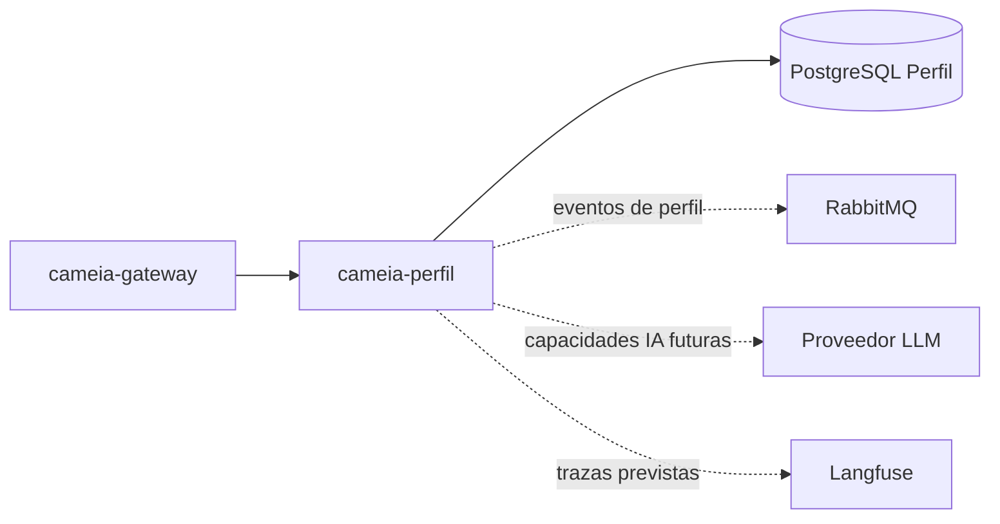

# cameia-perfil

Microservicio de Perfil Profesional de CAMEIA. Mantiene la información profesional del usuario, su procedencia y revisión, y los roles objetivo del MVP.

> **Estado:** repositorio creado para el Sprint 1. La base técnica corresponde a [CM-102](https://f0rktech.atlassian.net/browse/CM-102); este documento separa el alcance vigente de capacidades históricas o futuras.

## Alcance del Sprint 1

- Selección del método de configuración: [CM-16](https://f0rktech.atlassian.net/browse/CM-16).
- Información general y resumen profesional: [CM-17](https://f0rktech.atlassian.net/browse/CM-17).
- Experiencia laboral y educación: [CM-18](https://f0rktech.atlassian.net/browse/CM-18).
- Habilidades, expectativas y finalización: [CM-19](https://f0rktech.atlassian.net/browse/CM-19).
- Gestión de roles objetivo: [CM-20](https://f0rktech.atlassian.net/browse/CM-20).

La extracción automática de CV y las sugerencias de IA se mantienen como arquitectura prevista hasta que Jira las autorice expresamente.

## Responsabilidades

- Crear, editar y versionar el Perfil Profesional.
- Mantener experiencia, educación, habilidades, expectativas y roles objetivo.
- Registrar procedencia y estado de revisión de contenido asistido por IA.
- Conservar únicamente el texto extraído de un CV cuando esa capacidad entre en alcance.
- Publicar cambios del perfil mediante contratos aprobados.

No administra vacantes, postulaciones ni búsqueda de empleo. Empleo permanece Post-MVP.

## Contexto arquitectónico



## Tecnología

| Elemento | Línea base |
|---|---|
| Lenguaje | Java 21 |
| Framework | Spring Boot 4.1.1 |
| Build | Maven, con wrapper (`mvnw`) incluido en el repositorio |
| Persistencia | PostgreSQL 16, base/rol propios |
| Migraciones | Flyway |
| Documentación de API | springdoc-openapi 3.1.0 |
| Pruebas | JUnit 5, AssertJ, Mockito y ArchUnit |
| Contenedores | Docker y Docker Compose — ver [`docs/DOCKER.md`](docs/DOCKER.md) |
| Mensajería | RabbitMQ cuando existan contratos aprobados |
| Ejecución objetivo | Servicio HTTP y consumidor dentro del mismo repositorio/imagen |

## Estructura de paquetes

Capas DDD, según la hoja "Paquetes - Perfil Profesional" del diagrama de paquetes y la sección 3 de las reglas de código backend. Las carpetas vacías existen a propósito y se sostienen con `.gitkeep`: el sitio está decidido aunque el código aún no exista.

```text
co.edu.unicauca.cameia.perfil
├── presentation      controller · dto · advice
├── application       service · command
├── domain            model · service · policy · port · event · exception
└── infrastructure    persistence(entity · repository) · messaging(consumer · publisher · payload) · ia · config
```

Perfil **no** tiene `infrastructure/client`: su diagrama de paquetes no lo muestra, a diferencia de Cuentas, Entrevista y Empleo.

## Ejecución local

### Con Docker — recomendado

No requiere Java, Maven ni PostgreSQL instalados. Solo Docker.

```bash
# Instalación:  no aplica, la imagen se construye sola
docker compose build

# Pruebas:
docker compose run --rm verify

# Build:
docker compose build

# Inicio:
docker compose up -d

# Health check:
curl http://localhost:8082/actuator/health

# Apagar y borrar los datos:
docker compose down -v
```

### Sin Docker

Requiere JDK 21 y un PostgreSQL 16 con la base `cameia_perfil` y su rol ya creados.

```bash
# Instalación:
./mvnw -B dependency:go-offline

# Pruebas:
./mvnw -B clean verify

# Build:
./mvnw -B clean package

# Inicio:
./mvnw spring-boot:run

# Health check:
curl http://localhost:8082/actuator/health
```

En Windows, `mvnw.cmd` en vez de `./mvnw`.

### URL disponibles

| URL | Qué es |
|---|---|
| `http://localhost:8082/actuator/health` | Estado general |
| `http://localhost:8082/actuator/health/liveness` | ¿El proceso está vivo? Si falla, se reinicia el contenedor |
| `http://localhost:8082/actuator/health/readiness` | ¿Puede atender? Incluye la base de datos |
| `http://localhost:8082/actuator/info` | Información del servicio |
| `http://localhost:8082/swagger-ui.html` | Interfaz visual de OpenAPI |
| `http://localhost:8082/v3/api-docs` | JSON de OpenAPI, para generar clientes |

> **El puerto 8082 es PROVISIONAL.** El definitivo es `DEV-IN-05` y lo asigna quien arma la matriz ruta → servicio del API Gateway. 8082 sale del ejemplo local de la plantilla del Gateway, que no es una decisión aprobada. Se cambia con `SERVER_PORT` sin tocar la imagen.

## Variables de entorno

El catálogo completo está en [`.env.example`](.env.example), derivado de la plantilla del equipo para microservicios Spring. Solo se conserva la sección "Base común": quedan fuera RabbitMQ, Firebase, proveedor LLM, Langfuse, Wompi y dependencias HTTP internas.

Los valores sensibles están vacíos y el `.env` real no se versiona.

## Pruebas

| Prueba | Qué verifica |
|---|---|
| `PerfilApplicationTest` | Que el contexto de Spring levanta con la configuración del repositorio |
| `ArquitecturaTest` | Las siete reglas de dependencia entre capas de la sección 3.4 de las reglas de código, con ArchUnit |

`ArquitecturaTest` verifica que el dominio no dependa de otras capas, que no importe Spring, JPA ni RabbitMQ, que presentación no dependa de infraestructura, que no haya dependencias circulares, y que los sufijos `Controller`, `AppService` y `Entity` se respeten.

`PerfilApplicationTest` necesita la base de datos arriba, porque construye el `DataSource` y Flyway se conecta al arrancar.

### Convención de nombres

- Clase: `<ClaseBajoPrueba>Test` para unitarias, `<ClaseBajoPrueba>IT` para integración.
- Método: `<metodo>_deberia<Resultado>_cuando<Condicion>`.
- `@DisplayName` en español legible.
- Las pruebas de `domain` **no** levantan contexto de Spring. Si lo necesitan, no son de dominio.
- Cada Historia de Usuario llega con prueba positiva y negativa de cada regla de negocio que toca.
- Datos sintéticos o anonimizados, nunca reales.

```java
@Test
@DisplayName("Un perfil no pasa a COMPLETED si le faltan los datos mínimos")
void finalizar_deberiaLanzarPerfilIncompletoException_cuandoFaltanDatosObligatorios() { }
```

## Configuración, seguridad y calidad

- No guardar CV, PII, tokens, secretos ni `.env` en Git.
- Usar datos sintéticos o anonimizados en pruebas.
- Probar completitud, edición, versionamiento y autorización por propietario.
- Verificar procedencia/revisión cuando se incorpore IA.
- Activar CI únicamente con comandos comprobados por el responsable.
- El formato común de error es RFC 7807 (`application/problem+json`), activado con `spring.mvc.problemdetails.enabled`. Responde a `API-TBD-14`, que sigue abierto.

## Contribución

- `main` es estable y solo recibe promociones `develop → main` mediante Merge commit.
- `develop` integra ramas `CA-<numero>-<descripcion-kebab-case>` mediante Squash.
- Todo cambio ordinario entra mediante PR y revisión distinta del autor; la rama `CA-*` se elimina después.

> **Pendiente de confirmar por el equipo:** este README y la estrategia de branching dicen `CA-<numero>-<descripcion>`; el `CONTRIBUTING.md` de este repositorio y la plantilla de PR dicen `<tipo>/CM-NNN-<descripcion>`. Hay que unificarlo.

## Cuándo actualizar este README

Actualizarlo en el mismo PR que cambie propósito, stack, comandos, variables, endpoints, modelo de perfil, eventos, IA, persistencia, pruebas, despliegue o responsables. Si no aplica, justificarlo en el PR.
